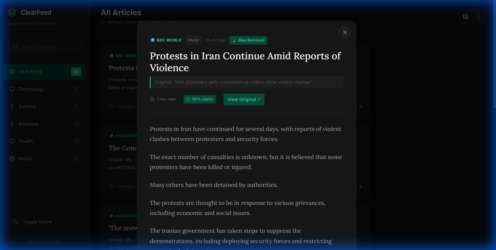

# ClearFeed - Read Without the Noise 🧠 ✨

**ClearFeed** is an AI-powered RSS reader designed to restore sanity to your news consumption. It uses LLMs (Groq/Llama 3) to filter out clickbait, remove sensationalism, and present only the factual core of every story.



## 🚀 Key Features

- **🛡️ Clickbait Shield**: Automatically rewrites sensational headlines into neutral, factual titles.
- **🧹 Bias Removal**: De-sensationalizes article content, stripping away emotional manipulation and "brainrot".
- **📊 AI Clarity Report**:
  - **Clarity Score**: A 0-100 rating of the article's signal-to-noise ratio.
  - **Key Facts**: 3 essential bullet points extracted from the fluff.
  - **Comparisons**: View the original clickbait title side-by-side with the cleaned version.
- **📱 Native PWA**: Installable on iOS and Android for a native app experience.
- **🚫 Distraction-Free UI**: text-focused design to help you read faster and clearer.

## 🛠️ Technology Stack

- **Frontend**: Vanilla JavaScript & CSS (No frameworks, pure performance)
- **Backend**: Node.js & Express
- **AI/LLM**: Groq API (running Llama 3.1 8B)
- **Data**: RSS Parser & Node-Cache

## 🏁 Getting Started

### Prerequisites

- Node.js installed
- A free [Groq API Key](https://console.groq.com/keys)

### Installation

1. **Clone the repository**
   ```bash
   git clone https://github.com/hulksan28/ClearFeed.git
   cd ClearFeed
   ```

2. **Install dependencies**
   ```bash
   npm install
   ```

3. **Set up Environment Variables**
   Create a `.env` file in the root directory:
   ```env
   GROQ_API_KEY=your_groq_api_key_here
   ```

4. **Run the App**
   ```bash
   npm start
   ```

5. **Open in Browser**
   Visit `http://localhost:3000`

## ☁️ Deployment (Render/Vercel)

**Crucial Step for Render:**
- **Build Command:** `npm install`
- **Start Command:** `node server.js` (OR `npm start`)
- **Do NOT** use `node main.js` (that is for the Desktop app only)

## 📱 Mobile Installation (PWA)

1. Host the app (or tunnel it via `npx localtunnel --port 3000`).
2. Open the URL in Safari (iOS) or Chrome (Android).
3. Tap **Share** (iOS) or **Menu** (Android) → **Add to Home Screen**.

## 🤝 Contributing

Pull requests are highlighted! If you have ideas for better prompts or UI improvements, feel free to fork and submit.

---
*Built with clarity in mind.*
